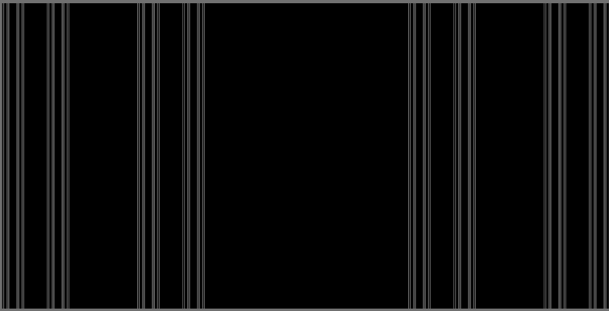
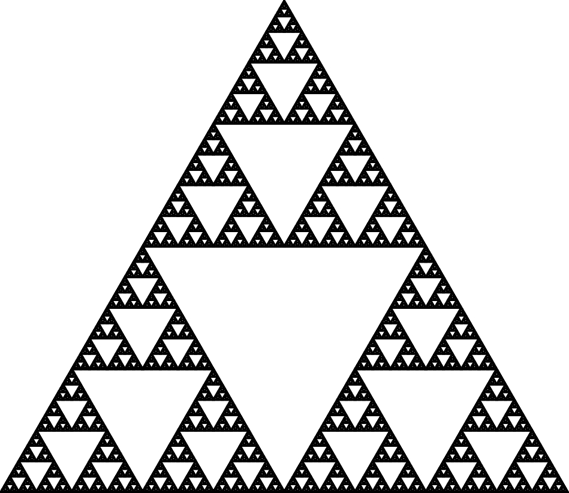
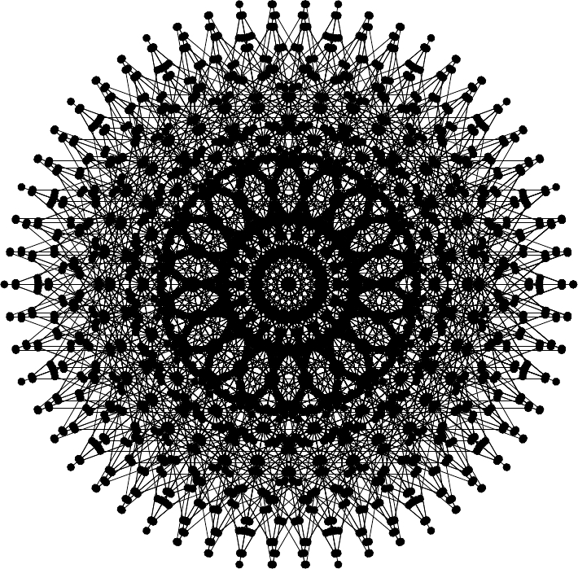
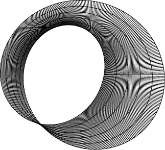
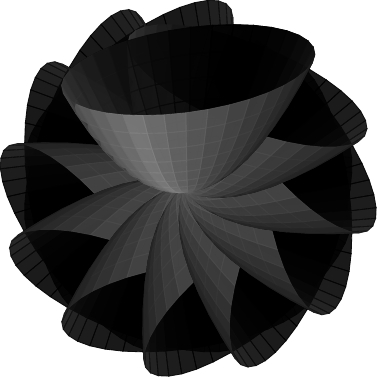
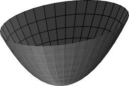
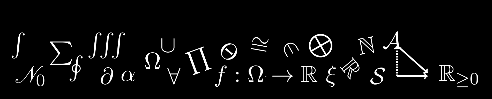
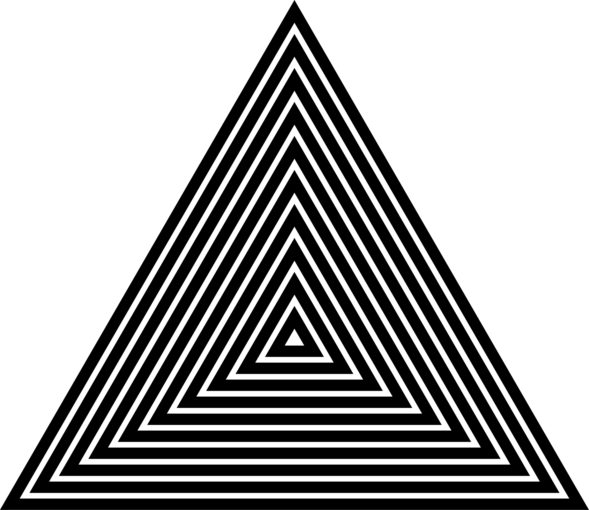
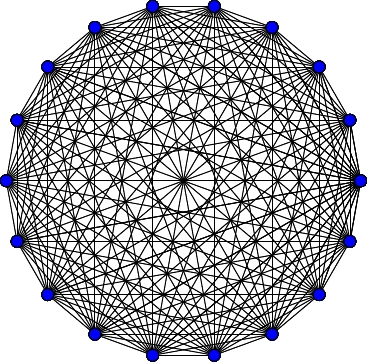
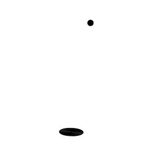

<!-- vim: foldmethod=marker: -->
# Drawings produced with LaTeX + Tikz

## Cantor Set 
<>{{{1
<ul style='list-style:none'>
    <li>
      <a href="tex/cantorSet.pl">
        tex/cantorSet.pl.
      </a>
      This PERL script 
      will produce a tex file. Using PERL to generate 
      the tex file can be quite useful;
    </li>
    <li>
      <a href="tex/cantorSet.tex">
        tex/cantorSet.tex.
      </a>
      Compile this file to generate the image
    </li>
</ul>
<div align='center'>
    
</div>
<>1}}}

## Coffee mug
#{{{1
I could only draw a coffee mug on <em>LaTex</em> thanks to this 
[help](https://tex.stackexchange.com/questions/145223/how-to-draw-a-coffee-cup).
I have only added the smoke comming from the hot coffee

<ul style='list-style:none'>
    <li>
      <a href="tex/coffee.tex">
        tex/coffee.tex.
      </a>
    </li>
</ul>
<div align='center'>
    
</div>
#1}}}

## Fractal 
#{{{1
<ul style='list-style:none'>
    <li>
      <a href="tex/fractal.pl">
        tex/fractal.pl.
      </a>
      Again, I use a PERL script to assist me
    </li>
    <li>
      <a href="tex/fractal.tex">
        tex/fractal.tex.
      </a>
      Compile this file to generate the image
    </li>
</ul>
<div align='center'>
    
</div>
#1}}}

## looping_and_saving_coordinates
#{{{1
<ul style='list-style:none'>
    <li>
      <a href="tex/looping_and_saving_coordinates.tex">
        tex/looping_and_saving_coordinates.tex.
      </a>
      Compile this file to generate the image. Whenever I need
      to remember how to save coordinates I can read this file to recall.
    </li>
</ul>
<div align='center'>
    
</div>
#1}}}

## An attempt to draw the Mobius strip
#{{{1
<ul style='list-style:none'>
    <li>
      <a href="tex/mobius_strip.tex">
        tex/mobius_strip.tex.
      </a>
      Compile this file to generate the image. 
    </li>
</ul>
<div align='center'>
    
</div>
#1}}}

## <em>pgfmathsetmacro</em>, <em>foreach</em> and <em>opacity</em>
#{{{1
<ul style='list-style:none'>
    <li>
      <a href="tex/modernArt.tex">
        tex/modernArt.tex.
      </a>
      Compile this file to generate the image. 
    </li>
</ul>
<div align='center'>
    
</div>
#1}}}

## A simple parabola
#{{{1
<ul style='list-style:none'>
    <li>
      <a href="tex/parabola3D.tex">
        tex/parabola3D.tex.
      </a>
      Compile this file to generate the image. 
    </li>
</ul>
<div align='center'>
    
</div>
#1}}}

## The image that I use at my website 
#{{{1
<ul style='list-style:none'>
    <li>
      <a href="tex/site_art.tex">
        tex/site_art.tex.
      </a>
      Compile this file to generate the image. 
    </li>
</ul>
<div align='center'>
    
</div>
#1}}}

## Triangles (even odd rule - fill)
#{{{1
<ul style='list-style:none'>
    <li>
      <a href="tex/triangles.tex">
        tex/triangles.tex.
      </a>
      Compile this file to generate the image. 
    </li>
</ul>
<div align='center'>
    
</div>
#1}}}

## A simple figure
#{{{1
<ul style='list-style:none'>
    <li>
      <a href="tex/weird01.tex">
        tex/weird01.tex.
      </a>
      Compile this file to generate the image. 
    </li>
</ul>
<div align='center'>
    
</div>
#1}}}

## Generating an animation
#{{{1
Suppose that you have a sequence of images ordered. Then
the with the help of the program <strong>convert</strong> and 
issuing 
```
convert -delay 20 -loop 0 *jpg animation.gif
```
we can create an animation in <em>gif</em>

<ul style='list-style:none'>
    <li>
      <a href="tex/animation_circle_plus_point/animation.pl">
        tex/animation_circle_plus_point/animation.pl
      </a>
       This perl script will create a sequence of tex file.
       These tex files will provide our images
    </li>
</ul>
<div align='center'>
    
</div>
#1}}}
